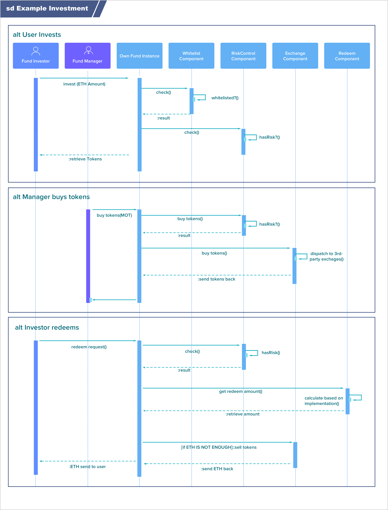
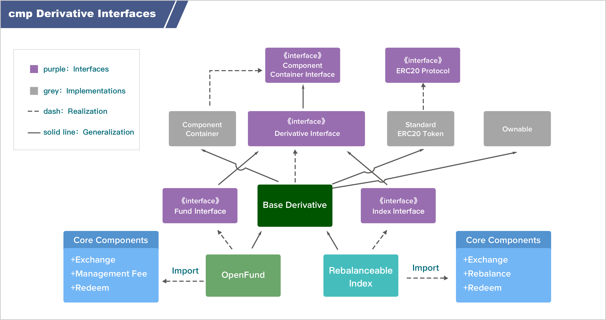

# Olympus Labs: Financial Component Based Architecture Design

Jerome Chen created: 2018-06-14, last updated:2018-06-20

### 1. Background

### 2. Overall design

### 3. Example workflow

### 4. Communication between protocols and components

### 5. Interfaces

### 6. Fee model and MOT usage

## Background

Olympus Labs is a blockchain financial ecosystem centered around the Olympus Protocol for the decentralized creation of cryptocurrency-based financial products.

We provide a web portal, SDKs, and APIs for financial product creators from both tech and non-tech backgrounds to easily create financial products for cryptocurrency investors.

Along with the development of the platform, it turns out the [original architecture](https://github.com/Olympus-Labs/OIPs/blob/master/OIPs/oip-1.md) built before no longer supports the further development of the system, thus we need to have a new architecture of the financial component based, which is highly extensible, reusable and makes developing of financial products much easier.

## Overall design

The overall idea is to have the entire system in different layers, each layer consists of its own parts. We will have four layers built into the system.

#### Layer 1: MOT

​ MOT is in the very core of the entire ecosystem which will be involved into all the modules / interactions.

#### Layer 2: Core Components

The components are highly reusable ones in all financial products / applications. Each of them should have its own speciality in its own area such as exchange components, fee caculators, etc. These can be used for different kinds of indices or funds, as well as the further products on our road map, like lending, options and futures.

#### Layer 3: Financial Protocols

​ This layer is focusing on more specific protocol level, it takes different components from layer 2 according to its own needs, just like building a house takes different parts. If you need to charge fees for your fund, just connect to a fee component, and the fee amount is already calculated for you. This makes it so easy to create financial protocols with only having to focus on the specific business logic instead of worrying about how to build the fundamental components such as selling tokens, whitelist, etc.

#### Layer 4: Financial Applications

​ Outside of the protocol is the applications layer. This is facing to organizations / end users, it includes Olympus App, Financial management portal, a DEX or a marketplace of financial products. It connects to the protocol to perform certain operations to serve customer's needs.

The diagram is described as below:


## Example workflow

Let's get into an example to see how it works in the ecosystem. We are involving 3 users here:

1.  Fund manager

2.  A financial smart contract developer

3.  Fund investors.

Firstly, a financial smart contract developer sees the opportunity of developing financial products in Olympus ecosystem, so he uses his expertise of finance combining with the highly reusable components and the base templates provided by OlympusLabs to create his own Fund product, and then he can register his fund template to Olympus Template gallery. Developer can decide what he wants for his fee part if any fund manager wants to use this to create their financial products.


After the fund template becomes available on Olympus Template available, on the Fund manager portal, the fund managers will be able to see its information including descriptive name, supported features, etc. They can choose this template to create their own fund instance after certain confirmation depending on how the fund provides. The fund manager will use the portal to do the operations such as buying / selling / withdrawal, etc.


When the fund instance is deployed to Ethereum, it registers to Olympus Marketplace, thus it's also available to its potential investors from different clients such as Olympus App / Portal or 3rd-party implementations like wallets. The investors can choose to invest on this fund instance by simply clicking the buy button on the client app / portal, then it interacts with the fund instance itself. Thanks to the base template, it implements the ERC20 standards, so investor automatically gets his fund token back to the address he specified.


## Example workflow

Let's take a look what happens from different perspectives from different user cases to show how the Fund instance communicates with core components.

When the fund template is created, it can hold different components and when the fund instance is initialized, the fund communicates with the specific components depending on what the action is. The components are highly reusable and can serve multiple contracts. In this case, the sample fund template uses whitelist, risk-control, withdrawal and exchange components.



# Interfaces

Let's take a look at the technical level of how the interfaces are and how a fund template is constructed.

First, all components implement ComponentInterface which basically describes itself, what the name is, which version it is and what it can do.


The definition is like below

```javascript
pragma solidity 0.4.24;


contract ComponentInterface {
    string public name;
    string public description;
    string public category;
    string public version;
}
```

On another hand, a financial product contains its own logic and a set of components. Base on that, we have defined the Derivative 1.0 interface.



The component container interface enables any contract implements it has the ability to set components dynamically which makes it powerful. Take an example, when a fund is created with a feature with basic monthly fee charged, later on, you want to change it to percentage base on the transaction amount, thanks to this, you just need to call setComponent function to change to another component which supports this and implements the same Chargeable interface.

```javascript
pragma solidity 0.4.24;


contract ComponentContainerInterface {
    mapping (string => address) components;

    event ComponentUpdated (string _name, address _componentAddress);

    function setComponent(string _name, address _componentAddress) public returns (bool success);
    function getComponentByName(string name) external view returns (address);
}
```

The Derivative interface implements ERC20, Ownable and ComponentContainerInterface. The ERC20 gives the derivative as a standard token and can be traded at any exchanges. The ownable makes the creator the permission control to do advanced operations such as setting up components.

```javascript
pragma solidity 0.4.24;

import "zeppelin-solidity/contracts/token/ERC20/ERC20.sol";
import "../libs/Ownable.sol";
import "./ComponentContainerInterface.sol";


contract DerivativeInterface is ERC20, Ownable, ComponentContainerInterface {

    enum DerivativeStatus { Active, Paused, Closed }
    enum DerivativeType { Index, Fund }

    string public description;
    string public category;
    string public version;
    DerivativeType public fundType;

    address[] public tokens;
    DerivativeStatus public status;

    // invest, redeem is done in transfer.
    function invest() public payable returns(bool success);
    function changeStatus(DerivativeStatus _status) public returns(bool);
    function getPrice() public view returns(uint);
}
```

Base on the Derivative interface we can de derive to multiple protocols for different tokenized derivatives like Fund, Index, or stable coin, lending, future or options. An example is like described below:

```javascript
pragma solidity 0.4.24;

import "./DerivativeInterface.sol";


contract IndexInterface is DerivativeInterface {
    uint[] public weights;
    bool public supportRebalance;

    // this should be called until it returns true.
    function rebalance() public returns (bool success);
}
```

```javascript
pragma solidity 0.4.24;

import "./DerivativeInterface.sol";


contract FundInterface is DerivativeInterface {
    function buyTokens(string _exchangeId, ERC20[] _tokens, uint[] _amounts, uint[] _rates)
        public returns(bool success);

    function sellTokens(string _exchangeId, ERC20[] _tokens, uint[] _amounts, uint[] _rates)
        public returns(bool success);
}
```

## Fee model and MOT usage

MOT plays a very important role in the new system, it's designated to be the currency in Olympus ecosystem. Without fee model, the system is not healthy to continue developing.

Each component has its own fee model, base on practice, there are different model for different types of components.

1.  Based on transaction amount.
2.  Based on subscription.
3.  Based on calls.

It seems only Exchange component fits on first model, and the rest can be neither second or third.

All the fee charged / redeemed can be paid by either Ether or MOT, fees paid with MOT will get 50% discount to encourge MOT usage in Olympus ecosystem.

By doing this, the fee charged from the end-users will be removed, and only the users of the component (Fund, Index) will be charged.
