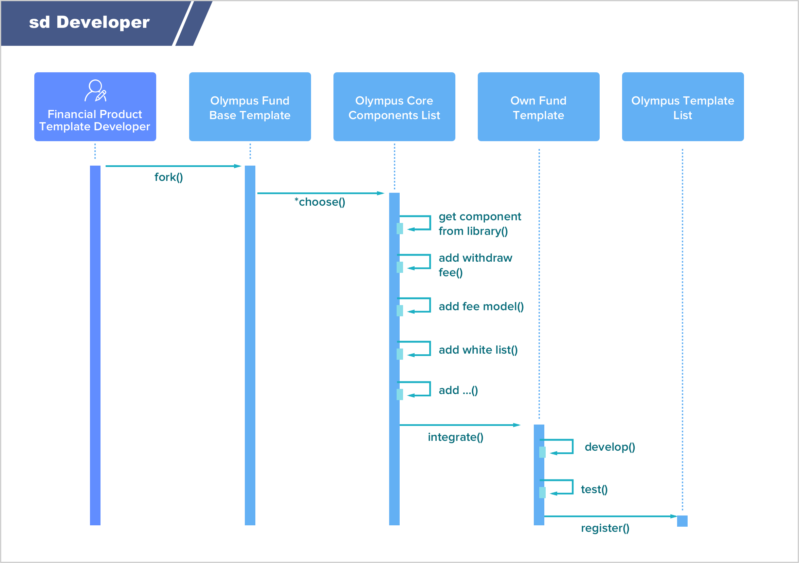
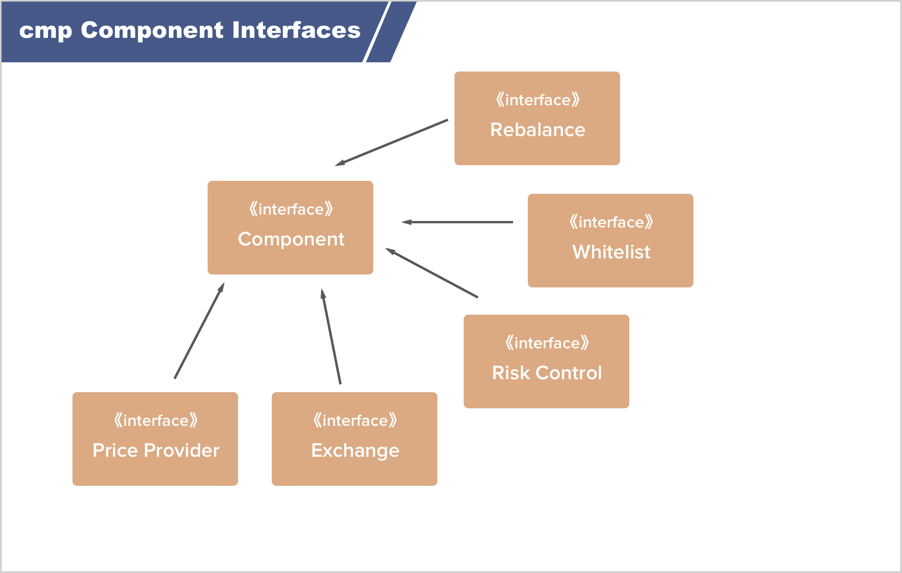

# Olympus Labs：基于组件的金融产品架构

Jerome Chen created: 2018-06-14, last updated:2018-06-20

Translated by riversyang, last updated: 2018-07-02

### 1. 背景

### 2. 总体设计

### 3. 示例流程

### 4. 协议和组件间的通信

### 5. 接口

### 6. MOT 通证经济


## 背景

Olympus 是一个开发通证化的加密货币金融产品（tokenized cryptocurrency financial products）的协议，可应用于指数、基金、借贷产品、期货和期权等。各类金融产品可以通过调用Olympus提供的交易、自动调仓、以及费用计算等核心组件轻松创建。

Olympus Labs 旨在通过 Olympus 协议来为下一代的金融科技 DApp 生态系统赋能。我们为开发者和既有应用程序提供了 APIs/SDKs 来进行集成，并且为他们的用户，诸如投资者和投资经理们提供通证化的金融产品和服务。

要支持这样一个生态系统，我们需要一个模块化的、分层设计的新架构。所以我们需要升级 [原先的设计](https://github.com/Olympus-Labs/OIPs/blob/master/OIPs/zh/oip-1.md) 。这份文档展示了一个高可用、可伸缩、可扩展且易于开发者构建和集成的新架构。


## 总体设计

新的架构是基于一种嵌套的分层架构设计的，每一层都是基于包含在其内的一层构建的。Olympus 生态系统总共包含了 3个层次，每一层都为其外的一层提供了相应的功能。


#### 第一层：核心组件（Core Components）

生态系统的第一层是核心组件。我们通过对金融界中的现有金融产品进行深入分析，提炼出了若干个核心功能；这些核心功能可以适用于不同的金融产品，因而我们开发了称为“核心组件”的高重用性功能模块。每一个核心组件会提供一个基本功能，比如允许通证的买卖、计算管理费用、处理风险控制等等。这些核心组件可以用来组合创建出诸如指数、基金、借贷产品、期货和期权之类的金融产品，同时它们也可以用来构建其它全新的金融产品。

#### 第二层：金融协议（Financial Protocols）

生态系统的第二层是金融协议。这一层由使用核心组件创建的金融产品模版所构成，就是我们提到的内层支持外层的开发。这一层中存在两种类型的金融产品模版。第一种是像指数这样的金融产品基础模版，它是作为某些产品类型的基础模版并作为标准来使用的。这些金融产品类型的所有模版都必须与基础模版标准相吻合，以便它们可以作为对应类型的金融产品模版来运作。

第二种模版就是定制模版。这些模版可以通过增加/修改基础模版中的核心组件来构建，或者重新组合核心组件来构建。模板开发者只需要专注于产品本身的逻辑就可以轻松构建金融产品，无需再去开发基础功能。例如，如果模板开发者正在创建一个需要计算管理费的基金，他/她可以简单地集成费用计算组件，而不用去自己构建这个功能。


#### 第三层：金融应用程序（Financial Applications）

生态系统的第三层就是金融应用程序，或 DApp 层。金融应用程序的 DApp 层将由 Olympus 协议所赋能。在这层中，我们预设了两大类应用：1、服务于金融产品创建者（投资经理和运维人员）的应用，和 2、服务于金融产品消费者（消费者和投资人）的 应用。Olympus 协议支持诸如钱包、投资组合跟踪应用、市场分析工具、用于创建和管理金融产品的投资管理应用、金融产品市场、金融产品交易所等金融科技应用。无论是既有应用还是构建新应用的开发者都可以通过使用我们的 APIs/SDKs 来集成 Olympus 协议，为他们的用户提供新一代金融产品和服务。

下图展示了 Olympus 生态系统的 3 个层级：


## 示例流程

让我们通过一个示例来看看生态系统是如何运作的。这里我们定义三个用户角色：
1. 金融产品模版开发者
2. 基金经理
3. 基金投资者

一个智能合约开发者看到了基于 Olympus 生态来开发金融产品的机会，然后他/她就使用 Olympus 核心组件和基础模版来创建他/她自己的基金模版，从而成为一个金融产品模版的开发者。开发完自有的基金模板（Own Fund Template）以后，他/她可以将其注册到 Olympus 协议的金融产品模版列表中。




在金融产品管理中心（Management Portal）或其它任何支持Olympus协议的管理应用里，基金经理可以选择他自己感兴趣的金融产品模板为基础来创建他们自己的金融产品。假设基金经理正好对刚刚定制出来的自有基金模板（Own Fund Template）感兴趣的话，那么他就可以选择这个模版，并根据他的要求设定具体的参数，比如他要收取的管理费率等，然后部署这个模版到以太坊网络来生成一个实际上的金融产品实例 （Own Fund Instance）。这个产品实例可以通过管理中心来进行集中管理，例如对产品里的数字货币进行买卖等操作。


当“定制基金实例”被部署到以太坊网络的时候，该实例会被自动注册到基于 Olympus 协议构建的一个通证化金融产品列表里，这样投资者们在面向终端用户的各种应用里就可以选择它们进行投资，将资产（如ETH）发送到该产品中，然后获得一定数量的基金Token。由于基金Token是符合ERC20标准的，所以他们可以在任何支持ERC20标准的钱包中被持有或转移。


## 核心组件和金融协议（金融产品模版）间的通信

我们以“定制基金实例”为例，来看看核心组件和金融产品模版间如何通信，以及基金经理和基金投资者之间如何通过模板和组件来进行交互。

基于“定制基金模版”的“基金产品实例”通过调用若干个核心组件组成。在这个例子里，它使用了白名单（whitelist）、风险控制（risk-control）、赎回（redeem）和交易（exchange）组件构成。下面的图表描述了基金经理和基金投资者之间的一些交互。


# 接口

本节将试图从技术层面来解释如何管理一个金融产品模版。

1、组件接口（ComponentInterface）
首先，每个核心组件都必须实现的组件接口，这些接口描述了组件的功能。




下面是一个接口定义的例子：

```javascript
pragma solidity 0.4.24;


contract ComponentInterface {
    string public name;
    string public description;
    string public category;
    string public version;
}
```

2、金融衍生品接口 (DerivativeInterface)

由于金融产品模版是通过组合使用核心组件构成的，所以我们需要定义一些衍生接口：


3、组件容器接口（ComponentContainerInterface）


组件容器接口非常强大，它允许金融衍生品与其核心组件进行动态交互。对于实现了同一个组件接口的不同实现和版本之间，可以简单的进行替换。系统维护了一个按照功能划分的组件清单，每个组件接口都有不同的实现和版本。以收取基金管理费为例来说：最初当基金创立的时候，它使用了一个按月收取固定管理费的费用组件；随后，基金经理想基于持有基金的某个比例来收取管理费，这时只需要简单地通过调用 updateComponent(FEE) 函数，就可以完成收费组件的升级切换。这将给予基金经理们空前的灵活性来创建、管理、调整它们的投资基金和其它产品。


```javascript
pragma solidity 0.4.24;


contract ComponentContainerInterface {
    mapping (string => address) components;

    event ComponentUpdated (string _name, address _componentAddress);

    function setComponent(string _name, address _componentAddress) public returns (bool success);
    function getComponentByName(string name) external view returns (address);
}
```

衍生品接口需要实现了 ERC20 标准、归属权（Ownable）组件和 组件容器等接口。实现 ERC20 标准使得所有的金融衍生产品与其它所有Token一样，可以在现有的钱包里持有、转账，交易所中进行交易、充值和提现等。归属权(Ownable)组件则提供了对那些仅允许由创建者使用的、高度敏感的功能控制，例如关闭基金，提取管理费等。

```javascript
pragma solidity 0.4.24;

import "zeppelin-solidity/contracts/token/ERC20/ERC20.sol";
import "../libs/Ownable.sol";
import "./ComponentContainerInterface.sol";


contract DerivativeInterface is ERC20, Ownable, ComponentContainerInterface {

    enum DerivativeStatus { Active, Paused, Closed }
    enum DerivativeType { Index, Fund }

    string public description;
    string public category;
    string public version;
    DerivativeType public fundType;

    address[] public tokens;
    DerivativeStatus public status;

    // invest, redeem is done in transfer.
    function invest() public payable returns(bool success);
    function changeStatus(DerivativeStatus _status) public returns(bool);
    function getPrice() public view returns(uint);
}
```

衍生品接口非常强大，它不仅是定义了目前的指数及基金，而且也定义了未来可扩展的金融产品协议，以构成全新的通证化金融产品，比如稳定币、借贷、期货或者期权。下面是一个实现样例：


```javascript
pragma solidity 0.4.24;

import "./DerivativeInterface.sol";


contract IndexInterface is DerivativeInterface {
    uint[] public weights;
    bool public supportRebalance;

    // this should be called until it returns true.
    function rebalance() public returns (bool success);
}
```

```javascript
pragma solidity 0.4.24;

import "./DerivativeInterface.sol";


contract FundInterface is DerivativeInterface {
    function buyTokens(string _exchangeId, ERC20[] _tokens, uint[] _amounts, uint[] _rates)
        public returns(bool success);

    function sellTokens(string _exchangeId, ERC20[] _tokens, uint[] _amounts, uint[] _rates)
        public returns(bool success);
}
```


## MOT 通证经济

MOT 在本系统架构里扮演极其重要的角色，它是用来访问 Olympus 核心组件的功能性通证。每个核心组件都有它自己的费用模型。目前考虑的费用模型有三大类：
1. 基于交易量（transaction volume）
2. 基于订阅（subscription）
3. 基于调用（call）
交易（exchange）核心组件采用了第一种模型，其他的组件则可以使用后两种模型。

这意味着当一个新的开发者创建了一个集成了 Olympus 协议的新的金融产品模版或 DApp 的时候，会有需要 MOT 的需求；当一个钱包为其用户提供 Olympus 产品的时候，会需要 MOT ；当投资经理们创建基金和金融产品来为他们的投资者提供服务时，会需要 MOT。也就是说，任何开发和对 Olympus 协议的使用都会增加MOT的需求。这种将费用模型包含进核心组件，并直接从衍生品中扣除使用费的设计，使得终端用户不需要直接支付产品使用费；可以提高用户体验和友好度。创建或购买通证化的 Olympus 金融产品与购买任何 ERC20 代币将没有区别。

通过核心组件服务所产生的使用费收入，将直接用于后续Olympus 协议的开发，用来构建 Olympus 生态系统；这也将相应地促进 MOT 的需求，从而创建一个可持续发展的良性循环。所以MOT 的价值是伴随着Olympus Labs 的成功而提升的，特别是 Olympus 协议和 Olympus 生态系统的发展。

