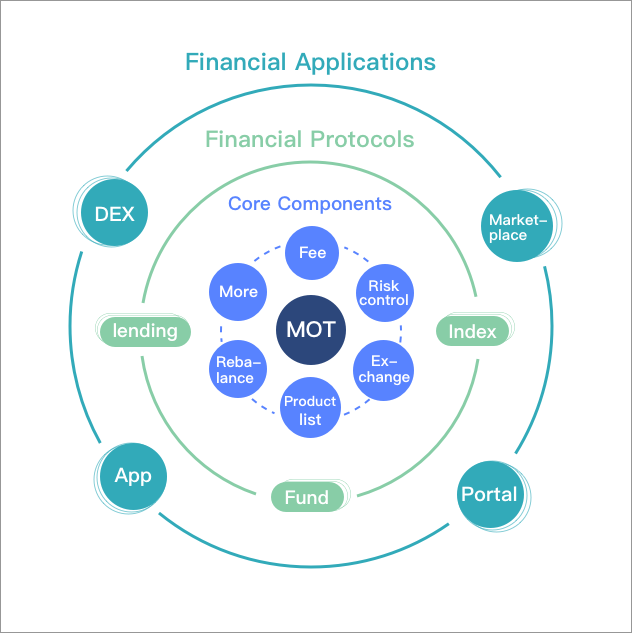
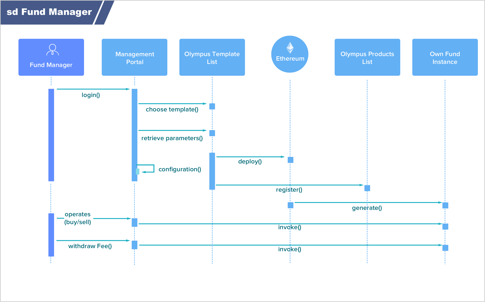
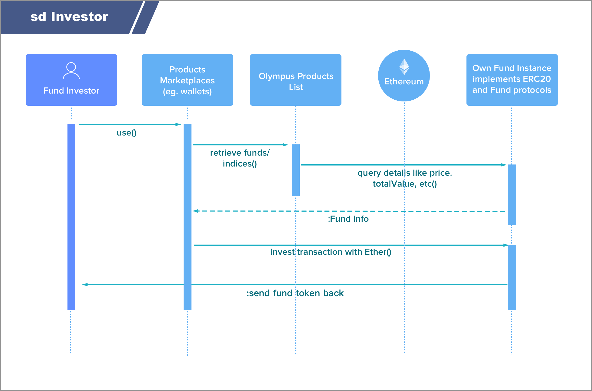

# Olympus Labs：基于组件的金融产品架构

Jerome Chen created: 2018-06-14, last updated:2018-06-20

Translated by riversyang, last updated: 2018-07-02

### 1. 背景

### 2. 总体设计

### 3. 示例流程

### 4. 协议和组件间的通信

### 5. 接口

### 6. MOT 通证经济


## 背景

Olympus Labs 是为了开发通证化的加密货币金融产品（tokenized cryptocurrency financial products）的一种协议，这些金融产品包括指数、基金、贷款产品、期货和期权等等。我们构建了一些类似于兑换、再平衡以及费用计算之类的核心组件，而金融产品则可以通过组合使用这些核心组件来构建。

Olympus Labs 旨在通过 Olympus 协议来为下一代的金融科技 DApp 生态系统赋能。我们为开发者和既有应用程序提供了 APIs/SDKs 来集成我们的协议，并且为他们的用户，诸如投资者和投资经理人们提供通证化的金融产品和服务。

要支持这样一个生态系统，我们需要一个模块化的、分层设计的新架构。所以我们需要升级 [原先的设计](https://github.com/Olympus-Labs/OIPs/blob/master/OIPs/zh/oip-1.md) 。这份文档展示了一个高可用、可伸缩、可扩展且易于开发者构建和集成的新架构。


## 总体设计

新的架构是基于一种嵌套的分层架构设计的，每一层都是基于包含在其内的一层构建的。Olympus 生态系统总共包含了 4 个层次，每一层都为其外的一层提供了相应的功能。


#### 第一层：MOT

生态系统的第一层是 Olympus 生态系统的原生通证 MOT，它是用来访问 Olympus 核心组件的功能性通证。

#### 第二层：核心组件（Core Components）

生态系统的第二层是核心组件。基于我们对金融世界中的既存金融产品的深入分析，我们将它们缩减为若干核心功能；这些核心功能可以服务于不同的金融产品，因而我们开发了称为“核心组件”的高重用性功能模块。每一个核心组件会提供一个基本功能，比如允许通证的买卖、计算管理费用、引导风险控制等等。这些核心组件可以用来组合创建出诸如指数、基金、贷款产品、期货和期权之类的金融产品，同时它们也可以用来构建全新的金融产品。

#### 第三层：金融协议（Financial Protocols）

生态系统的第三层是金融协议。这一层由一些使用核心组件创建的金融产品模版所构成，这就是我们看到的内层将支持外层的开发。这一层中存在两种金融产品模版。第一种是像指数这样的金融产品基础模版，它是作为某些产品类型的基础模版并作为标准来使用的。这些金融产品类型的所有模版都必须与基础模版相吻合，以便它们可以作为对应类型的金融产品模版来运作。

第二种模版就是定制模版。这些模版可以通过增加/修改基础模版中的核心组件来构建，或者重新组合核心组件来构建。产品创建人可以仅关注产品的逻辑而不用去开发基础功能，金融产品模版则可以通过这种方式简单的构建出来。例如，如果产品创建人正在创建一个需要计算他/她的管理费的基金，他/她可以简单地集成费用计算组件，而不用去自己构建那种功能。

#### 第四层：金融应用程序（Financial Applications）

生态系统的第四层就是金融应用程序，或 DApp 层。金融应用程序的 DApp 层将由 Olympus 协议所赋能。在这层中，我们预想了两大类 DApp：1、服务于金融产品出品人（投资经理和产品创建者）的 DApp，和 2、服务于金融产品消费者（消费者和投资人）的 DApp。Olympus 协议支持诸如钱包、投资组合跟踪应用、市场分析工具、用于创建和管理金融产品的投资管理应用、金融产品市场、金融产品交易所等等的金融科技应用。无论是既有应用还是构建新应用的开发者都可以通过使用我们的 APIs/SDKs 来集成 Olympus 协议，为他们的用户提供下一代金融产品和服务。

下图展示了 Olympus 生态系统的 4 个层级：




## 示例流程

让我们通过一个示例来看看生态系统是如何工作的。这里我们定义三个用户角色：

1.  金融产品模版开发者
2.  基金经理
3.  基金投资者

最初，一个智能合约开发者也许会看到那些基于 Olympus 生态来开发金融产品的机会，然后他/她可以使用 Olympus 核心组件和基础模版来创建他/她自己的基金模版，从而成为一个金融产品模版的开发者。随后他/她可以将他/她自己的基金模版（Own Fund Template）注册到 Olympus 协议的金融产品模版列表中。


现在这个自定义模版（Own Fund Template）已经被添加到模版列表中了，基金经理们可以通过任意的 DApp 来创建和管理基金，这就是所谓的“管理入口（Management Portal）”。在管理入口中，基金经理可以看到一系列的基金模版，包含它们所支持的功能特性以及定制的内容。我们假设他喜欢这个刚刚定制出来的基金模版所提供的功能，那么他就可以选择这个模版，并根据他自己的要求设定具体的参数，比如他要收取的管理费率，然后部署这个模版来获得一个（合约）实例。他部署的这个智能合约形式的通证化基金，就可以称作“定制基金实例（Own Fund Instance）”。随后他就可以通过管理入口来管理他的基金/智能合约，控制对加密货币的买卖等操作。



当“定制基金实例”被部署到以太坊网络的时候，它会被注册到基于 Olympus 协议构建的一个通证化金融产品列表中。于是投资者们就可以通过任意面向用户的 DApp 比如钱包之类来向它进行投资业务。

基金投资者可以在 DApp 中选择来买入这个基金，简单讲就是发送他的投资（比如 Eth），然后获得基金中的若干 token。由于基金中的 token 都是符合 ERC20 标准的通证化的产品，所以这些基金 token 可以被自动地发送到基金投资者的钱包地址中。




## 核心组件和金融协议（金融产品模版）间的通信

让我们以“定制基金实例”为例看看核心组件和金融产品模版间是如何通信的，以及基金经理和基金投资者之间是如何进行交互的。

基于“定制基金模版”的“定制基金实例”由若干核心组件组成。在这个例子里，它由白名单（whitelist）、风险控制（risk-control）、赎回（redeem）和交易（exchange）组件构成。下列图表对一些基金经理人和基金投资者之间的交互实例做了解释说明。


# 接口

本节将解释如何从技术层面管理一个金融产品模版。

1、组件接口

首先，每个核心组件都需要实现它的组件接口，这些接口描述了组件的功能。


下面是一个接口定义的例子：

```javascript
pragma solidity 0.4.24;


contract ComponentInterface {
    string public name;
    string public description;
    string public category;
    string public version;
}
```

2、接口衍生

由于金融产品模版是通过组合使用核心组件构成的，所以我们需要定义一些衍生接口：


3、组件容器接口

组件容器接口是一个很强大的特性，它允许金融产品与构成这个产品的核心组件进行动态交互。像各种计算管理费用这样的具有相同类型的核心组件，可以简单地进行替换。让我们以基金管理人收取基金管理费为例来说明这点。最初当基金创立的时候，它使用了一个每月收取固定管理费的费用组件；随后，基金经理人向基于资产的某个比例来收取管理费，这可以简单地通过调用 setComponent 函数来对原始的费用组件进行切换。这将给予基金经理们空前的灵活性来创建、管理、调整它们的投资基金和投资产品。


```javascript
pragma solidity 0.4.24;


contract ComponentContainerInterface {
    mapping (string => address) components;

    event ComponentUpdated (string _name, address _componentAddress);

    function setComponent(string _name, address _componentAddress) public returns (bool success);
    function getComponentByName(string name) external view returns (address);
}
```

衍生接口需要实现了 ERC20 标准、归属权（Ownable）组件和 ComponentContainerInterface。实现 ERC20 标准将为通证化产品提供与在钱包里或者在交易所业务中所同样的互操作性。归属权组件则提供了对那些仅允许由创建者使用的、诸如切换组件之类的高级操作的控制功能（即仅允许合约创建者使用这些高级功能）。

```javascript
pragma solidity 0.4.24;

import "zeppelin-solidity/contracts/token/ERC20/ERC20.sol";
import "../libs/Ownable.sol";
import "./ComponentContainerInterface.sol";


contract DerivativeInterface is ERC20, Ownable, ComponentContainerInterface {

    enum DerivativeStatus { Active, Paused, Closed }
    enum DerivativeType { Index, Fund }

    string public description;
    string public category;
    string public version;
    DerivativeType public fundType;

    address[] public tokens;
    DerivativeStatus public status;

    // invest, redeem is done in transfer.
    function invest() public payable returns(bool success);
    function changeStatus(DerivativeStatus _status) public returns(bool);
    function getPrice() public view returns(uint);
}
```

衍生接口非常强大，它可以用来对协议进行衍生，以构成全新的通证化金融产品，比如基金、指数、稳定币、贷款、期货或者期权。下面是一个实现样例。


```javascript
pragma solidity 0.4.24;

import "./DerivativeInterface.sol";


contract IndexInterface is DerivativeInterface {
    uint[] public weights;
    bool public supportRebalance;

    // this should be called until it returns true.
    function rebalance() public returns (bool success);
}
```

```javascript
pragma solidity 0.4.24;

import "./DerivativeInterface.sol";


contract FundInterface is DerivativeInterface {
    function buyTokens(string _exchangeId, ERC20[] _tokens, uint[] _amounts, uint[] _rates)
        public returns(bool success);

    function sellTokens(string _exchangeId, ERC20[] _tokens, uint[] _amounts, uint[] _rates)
        public returns(bool success);
}
```


## MOT 通证经济

MOT 在这种系统架构里扮演了极其重要的角色，它是一种用来访问 Olympus 核心组件的功能性通证。每个核心组件都有它自己的费用模型。目前考虑的费用模型有三大类：

1.  基于交易量（transaction volume）
2.  基于订阅（subscription）
3.  基于调用（call）

交易（exchange）核心组件采用了第一种模型，其他的组件则可以使用后两种模型之一。

将 MOT 的使用与核心组件挂钩的这种费用设计的关键用意是 MOT 的价值应该直接与 Olympus Labs 的成功所对应，特别是 Olympus 协议和 Olympus 生态系统的成功。这意味着当一个新的开发者创建了一个集成了 Olympus 协议的新的金融产品模版或 DApp 的时候，会需要 MOT 的供给；当一个钱包为其用户提供 Olympus 产品的时候，会需要 MOT 的供给；当投资经理们创建基金和金融产品来为他们的投资者提供服务时，会需要 MOT 的供给。也就是说，任何开发和对 Olympus 协议使用的需求都会需要增加 MOT 的供给。

这种将费用模型包含进核心组件，并直接从基金中扣减使用费的设计，还可以使最终用户不需要直接支付 Olympus 生态系统的使用费；这可以使用户体验更加简明，创建或购买通证化的 Olympus 金融产品与购买任何 ERC20 代币将没有区别。

通过核心组件服务所产生的费用收入，将直接用于后续的开发，也就是 Olympus 协议的开发，并用来构建 Olympus 生态系统；这也将相应地产生更多对 MOT 的供给需求，从而创建一个可持续发展的良性循环。
